한양대학교 에리카 모바일어플리케이션 수업 개인 프로젝트

# TogetherClass

대학 수업 중 교수님과 학생들간의 소통을 원활하게 하기 위한 어플리케이션.

## Function

- 회원 가입 없이 로그인
- 실시간 채팅 : 수업 시간 중 질문 사항을 적는다.
- 알림 보내기 : 수업 시간 중 다시 설명을 원할 때, 교수님 스마트폰에서 알람이 울리게 한다.
- 자유게시판 : 과목별로 분류되어 있다.
- 교수님 정보 보기 : 교수님께 이메일 보내기 및 사이트 접속이 간편하다.
- D-day 등록 : 개인 스케쥴 관리를 할 수 있다.
- 수업 공지 : 교수님께서 수업 공지한 사항을 확인할 수 있다.
- 날씨 표시 : 기상청 rss에서 날씨를 가져와 보여준다.
- 로그인 내역 : 로그인 했던 정보가 남겨진다.

## Screenshot

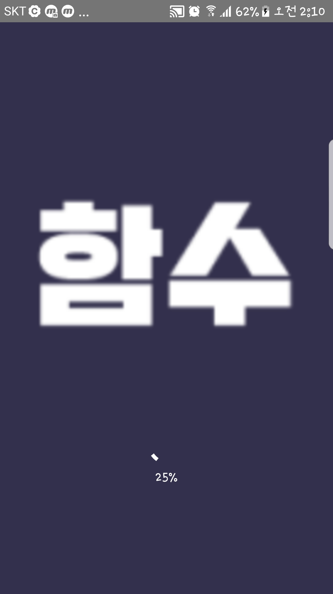 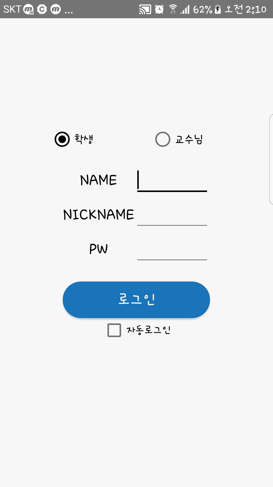 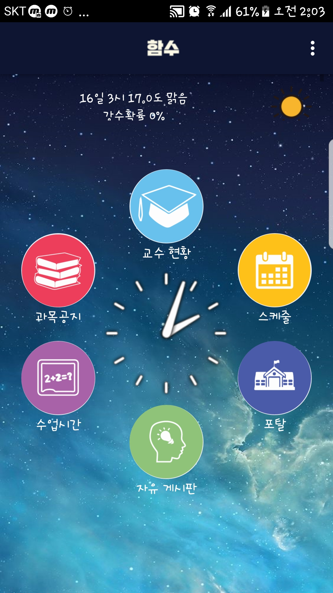
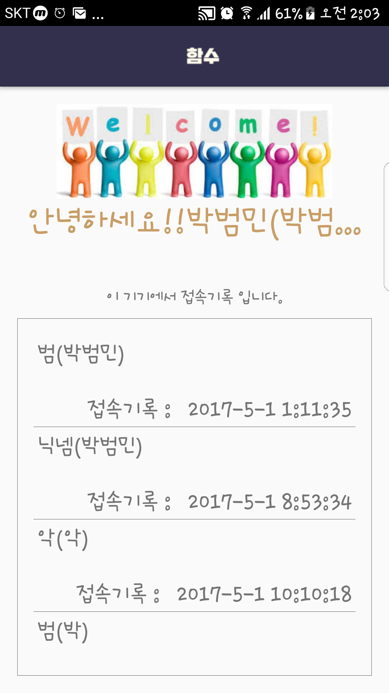 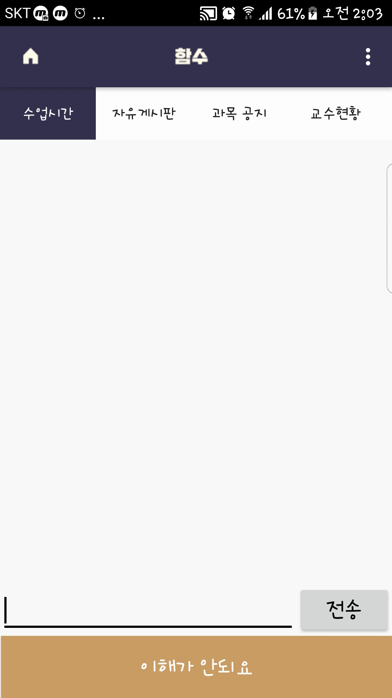 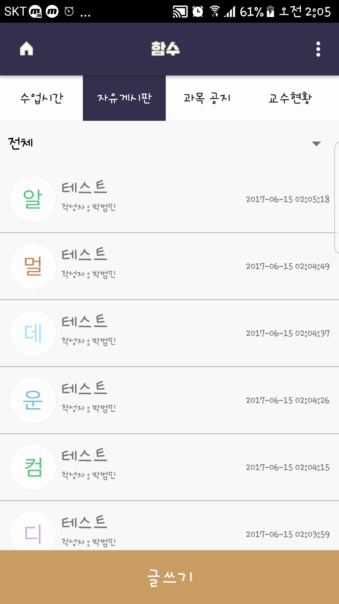
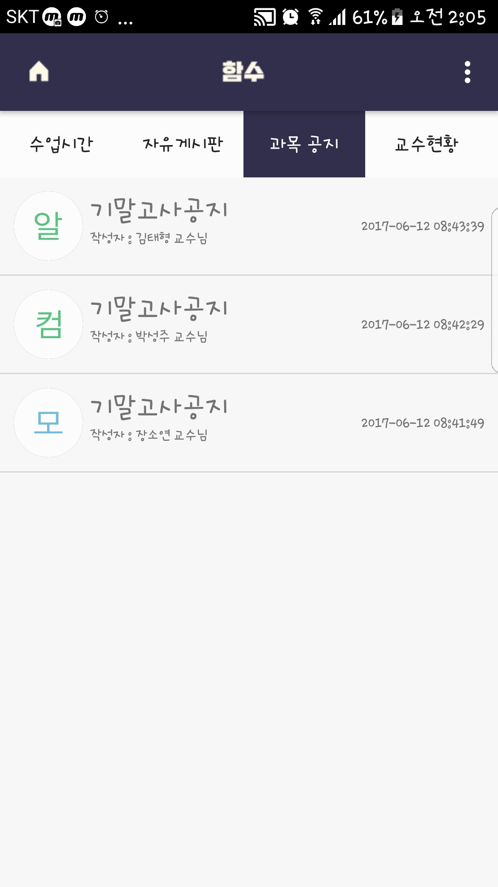 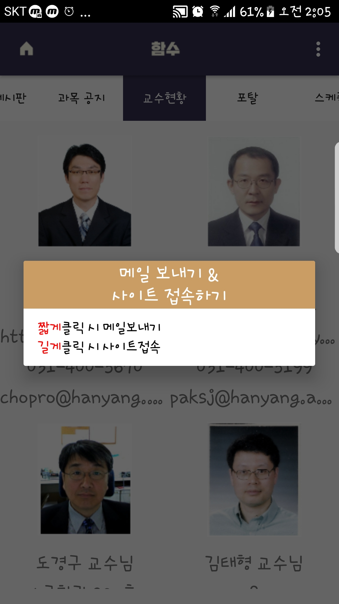 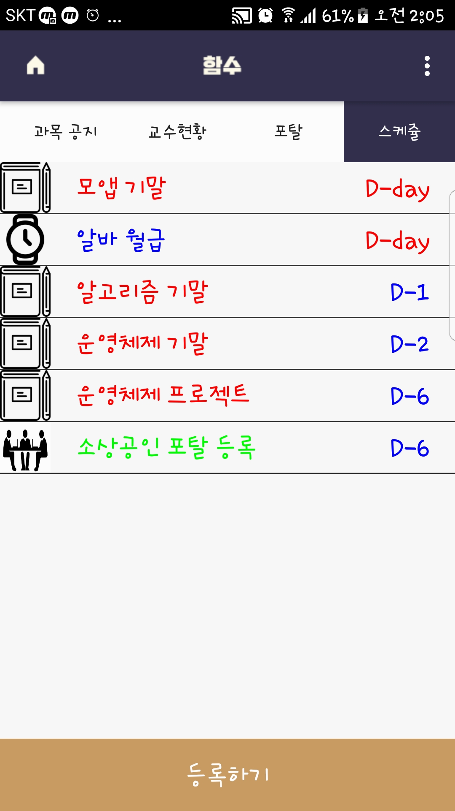
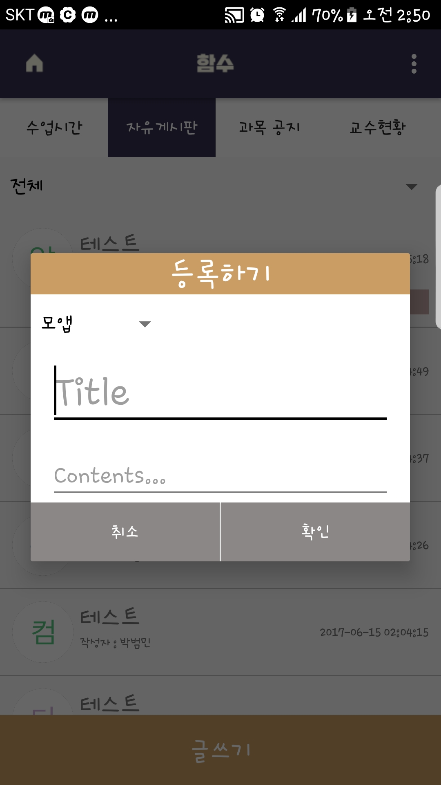 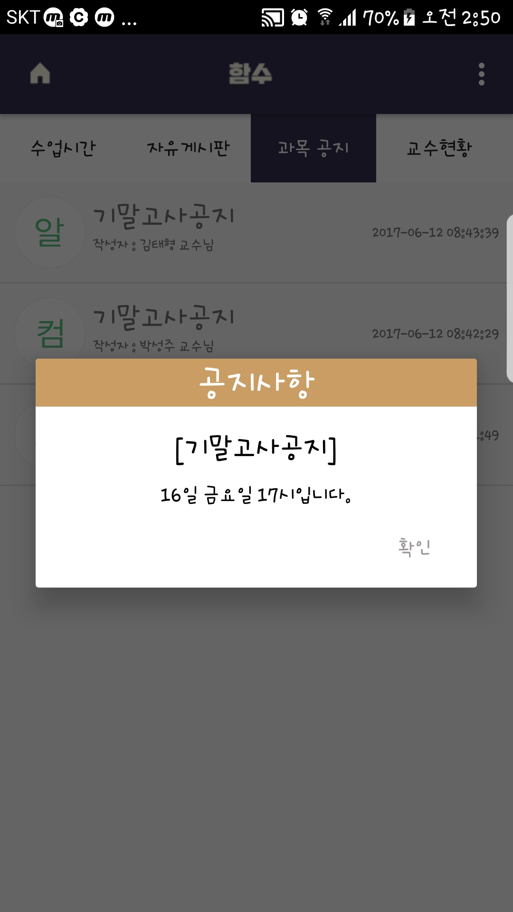 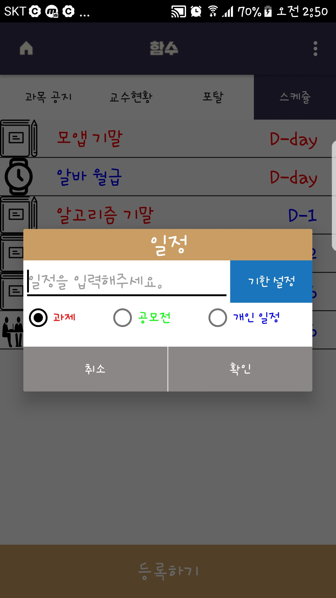

## Used Library & API

- volley

## Goal

- 아이디어 기획 및 구현
- 안드로이드 개념 활용
- http통신 경험
- 프로젝트 완성 경험
